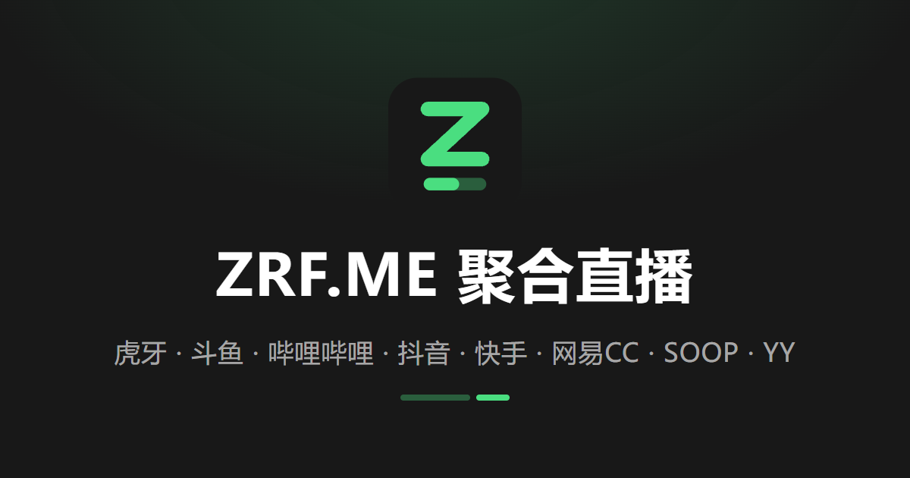
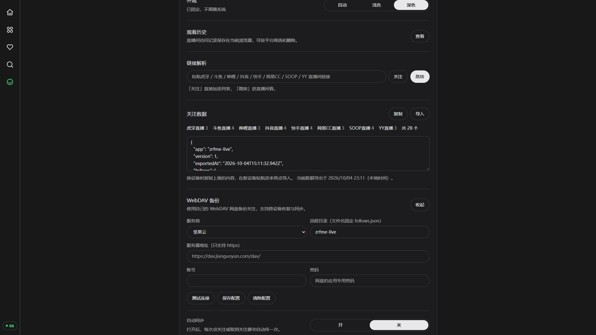

# ZRF.ME 聚合直播

打开网页即可观看虎牙、斗鱼、哔哩哔哩、抖音、快手、网易CC、SOOP、YY 等平台的直播，不用安装客户端。

## 域名

分别部署在不同平台，某一家出故障时换另一条即可：

- Cloudflare：https://live.zrfme.com
- EdgeOne：https://live.zrfme.net
- Netlify：https://live.itzrf.com
- Vercel：https://live.zrfme.de

## 预览

**首页**

**播放**

**分区**

**关注**

**我的**

## 支持

| 平台 | 直播 | 分区 | 搜索 | 弹幕 |
|---|---|---|---|---|
| 虎牙直播 | 支持 | 支持 | 支持 | 支持 |
| 斗鱼直播 | 支持 | 支持 | 支持 | 支持 |
| 哔哩哔哩直播 | 支持 | 支持 | 支持 | 支持 |
| 抖音直播 | 支持 | 支持 | 直播间 ID / URL | 支持 |
| 快手直播 | 支持 | 支持 | 不支持 | 支持 |
| 网易CC直播 | 支持 | 支持 | 支持 | 不支持 |
| SOOP直播 | 支持 | 支持 | 支持 | 支持 |
| YY直播 | 支持 | 支持 | 支持 | 支持 |

## 关注与备份

关注列表默认保存在浏览器本地，不需要注册账号。支持 JSON 导入 / 导出；也可以在「我的」页面配置 WebDAV，把关注数据备份到自己的网盘，换设备时从云端合并回来。

WebDAV 地址仅支持 HTTPS，备份文件固定为 `follows.json`。

还没有网盘的话，推荐两个支持 WebDAV 的免费方案（pCloud、InfiniCLOUD），注册和填写步骤见博客的[云端备份（推荐）](https://blog.zrf.me/p/zrfme-live/#%E4%BA%91%E7%AB%AF%E5%A4%87%E4%BB%BD%EF%BC%88%E6%8E%A8%E8%8D%90%EF%BC%89)。

## 致谢

我长期使用 [lemon-live](https://github.com/lemonfog/lemon-live) 看直播，它用不了之后才有了这个项目。

- [lemon-live](https://github.com/lemonfog/lemon-live) — 项目最初的使用与灵感来源
- [pure_live](https://github.com/liuchuancong/pure_live) — 平台内核、能力模型和播放器行为的主要参考
- [Simple Live](https://github.com/xiaoyaocz/dart_simple_live) — 站点接口抓取思路参考
- [douyinLive](https://github.com/jwwsjlm/douyinLive) / [douyinlive-proto](https://github.com/jwwsjlm/douyinlive-proto) — 抖音 Webcast 弹幕接入
- [hls.js](https://github.com/video-dev/hls.js) — HLS 播放内核
- [mpegts.js](https://github.com/xqq/mpegts.js) — FLV 播放内核
- [YXVM](https://yxvm.com/) — 后端服务器赞助

前端基于 [Vue 3](https://github.com/vuejs/core)、[Vite](https://github.com/vitejs/vite) 和 [UnoCSS](https://github.com/unocss/unocss) 构建。

---

仅供学习交流，请遵守各平台的服务条款。
